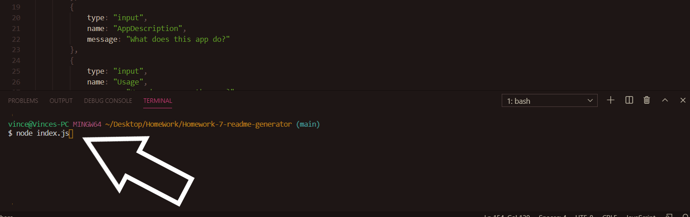
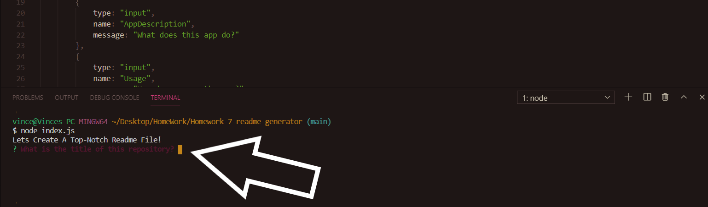
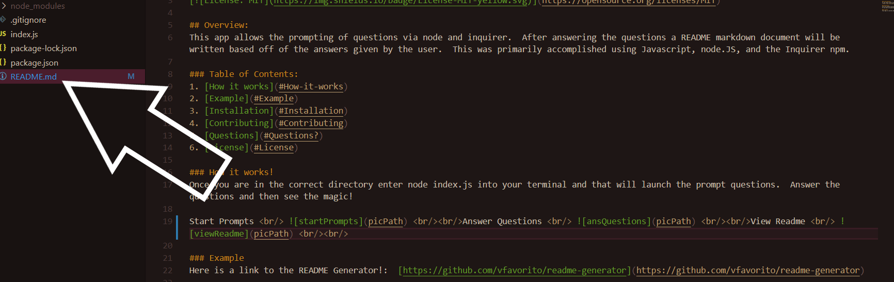

# README Generator!

## Overview:
This app allows the prompting of questions via node and inquirer.  After answering the questions a README markdown document will be written based off of the answers given by the user.  This was primarily accomplished using Javascript, node.JS, and the Inquirer npm.  

### Table of Contents:
1. [How it works](#How-it-works)
2. [Example](#Example)
3. [Installation](#Installation)
4. [Contributing](#Contributing)
5. [Questions](#Questions)
6. [License](#License)

### How it works!
Once you are in the correct directory enter node index.js into your terminal and that will launch the prompt questions.  Answer the questions and then see the magic!

Start Prompts      
Answer Questions      
View Readme      

### Example
Here is a link to the README Generator!:  [https://github.com/vfavorito/readme-generator](https://github.com/vfavorito/readme-generator) 
Here is a link to an example video of how to use the generator: [Example](https://drive.google.com/file/d/1_RfnJctB-au6l0SbAVAnw0J6g2_EFZaI/view)

### Installation
After cloning the repository onto your local machine get into that directory via terminal/gitbash.  Then run command npm i to install all packages.  After that you are good to go!

### Contributing
If you would like to contribute to the development of this app the guidelines for doing so can be found here: [Contribution Covenant](https://www.contributor-covenant.org/version/2/0/code_of_conduct/code_of_conduct.txt)

### Questions?
Visit my Github profile here: [vfavorito](https://github.com/vfavorito) 
If you have any questions you can reach out to me at vince.favorito@gmail.com

### License
This App is covered under the MIT License

